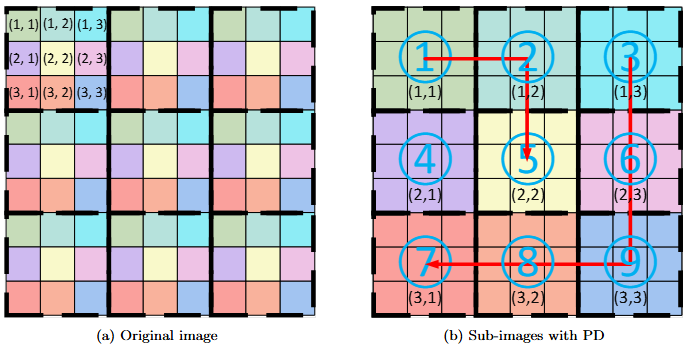
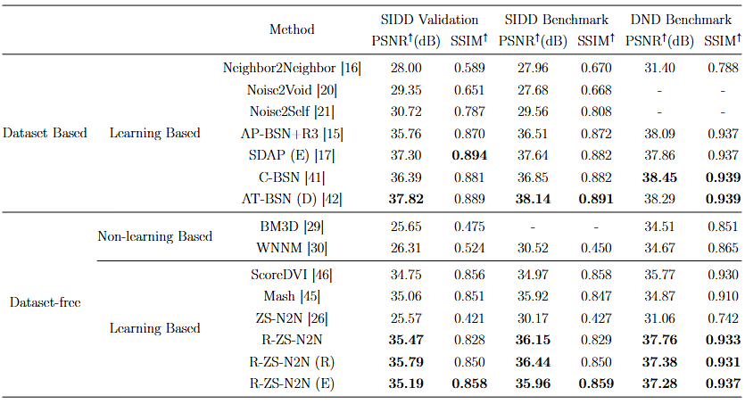
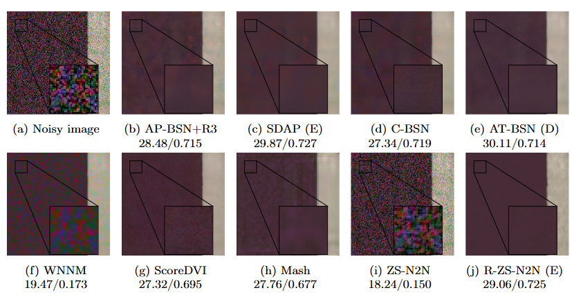
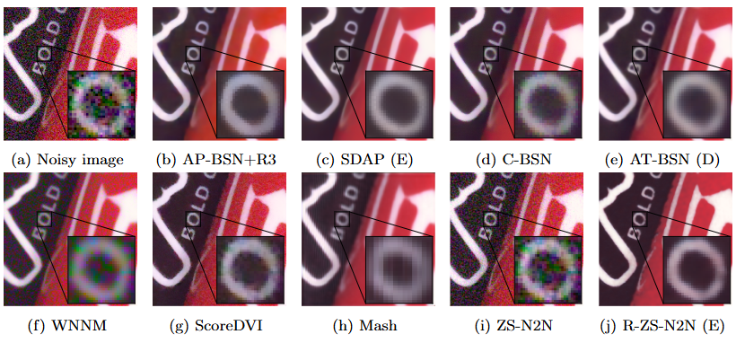
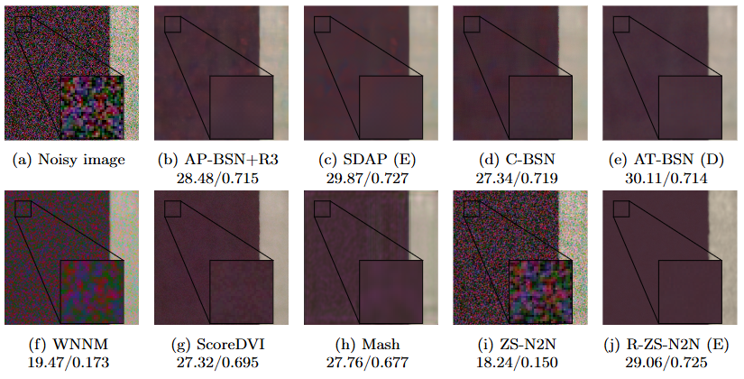
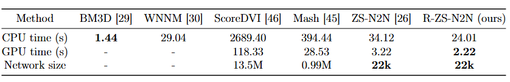

# Enhancing Zero-Shot Real-World Image Denoising via Rolling Up Noise2Noise with Distant-Neighbor Regularization

zhanzhanblue. (2025). zhanzhanblue/R-ZS-N2N: R-ZS-N2N (V1.0.1). Zenodo. https://doi.org/10.5281/zenodo.17600294

This repository is the official PyTorch implementation of R-ZS-N2N: Enhancing Zero-Shot Real-World Image Denoising via Rolling Up Noise2Noise with Distant-Neighbor Regularization. R-ZS-N2N achieves state-of-the-art performance in SIDD Validation, SIDD Benchmark and DND Benchmark.

## Environment
The main required installation packages are as follows, all of which can be installed using ***pip install***.
- [torch](https://pytorch.org/)
- PIL

The rest can be found in the ***requirements.txt*** file for the required environment.

## Datasets
You can access the dataset download link at:
 [SIDD dataset](https://abdokamel.github.io/sidd/) and 
[DND dataset](https://noise.visinf.tu-darmstadt.de/).

Place these datasets in the datasets directory.

## Evaluation
Since it is single-image denoising, training and testing are performed simultaneously.
You can run it directly based on the required dataset:
- sidd_validation.py
- sidd_benchmark.py 
- dnd_benchmark.py

```
python sidd_validation.py
python sidd_benchmark.py 
python dnd_benchmark.py
```

## A toy illustration of a Uniform Sampler with distance calculation



## Results


<details>
<summary>Quantitative comparison of various denoising methods on three real-world datasets: SIDD Validation, SIDD Benchmark, and DND Benchmark.</summary>



</details>

<details>
<summary>Visual comparison of our method with other denoising approaches on the SIDD Validation dataset</summary>



</details>

<details>
<summary>Visual comparison of our method with other denoising approaches on the DND Benchmark dataset</summary>



</details>
<details>
<summary>Visual comparison of our method with other denoising approaches on the SIDD Benchmark dataset</summary>



</details>

<details>
<summary>uantitative comparison of computational efficiency metrics including network size, CPU inference time, and GPU inference time across state-of-the-art denoising methods on the SIDD Validation dataset.</summary>



</details>
